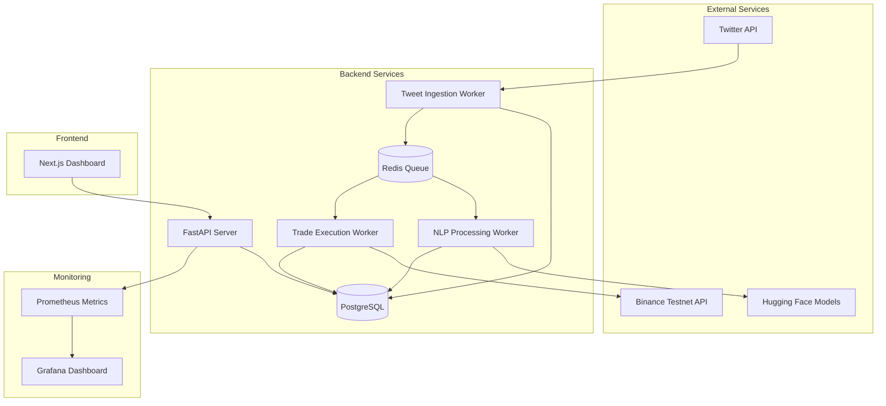

# Design Document

## Overview

The tweet-driven crypto trading bot is a distributed system that monitors social media for crypto-related content, analyzes sentiment, and executes automated trades. The architecture follows a microservices pattern with async workers, REST APIs, and a modern web dashboard.

### Key Design Principles
- **Separation of Concerns**: Clear boundaries between tweet ingestion, NLP processing, trading, and UI
- **Async Processing**: Non-blocking operations using Celery workers for scalability
- **Idempotency**: All operations can be safely retried without side effects
- **Observability**: Comprehensive logging and metrics for monitoring
- **Security**: Testnet-only trading with secure credential management

## Architecture

### High-Level Architecture



### Service Architecture

The system consists of four main services:

1. **FastAPI Server**: REST API and health checks
2. **Tweet Ingestion Worker**: Polls Twitter API and stores tweets
3. **NLP Processing Worker**: Analyzes tweets for sentiment and signals
4. **Trade Execution Worker**: Executes trades based on signals

### Data Flow

1. **Tweet Ingestion**: Worker polls Twitter API → stores raw tweets in PostgreSQL
2. **NLP Processing**: Worker processes unanalyzed tweets → calculates signal scores
3. **Trade Execution**: Worker monitors high-score signals → executes trades via Binance API
4. **Dashboard Updates**: Frontend fetches data via FastAPI REST endpoints

## Components and Interfaces

### Backend Components

#### FastAPI Server (`app/main.py`)
- **Purpose**: REST API endpoints and health checks
- **Responsibilities**:
  - Serve dashboard data (tweets, trades, positions, metrics)
  - Health check endpoints for monitoring
  - Manual override controls
  - Prometheus metrics exposure

**Key Endpoints**:
```python
GET /health                    # Health check
GET /api/tweets               # Recent tweets with signals
GET /api/trades               # Trade history
GET /api/positions            # Current positions
GET /api/metrics              # System metrics
POST /api/override/toggle     # Manual trading override
```

#### Tweet Ingestion Worker (`workers/tweet_ingestion.py`)
- **Purpose**: Poll Twitter API and store tweets
- **Responsibilities**:
  - Poll Twitter API every 60 seconds
  - Deduplicate tweets using tweet ID
  - Store raw tweet data with metadata
  - Handle API rate limiting

**Key Functions**:
```python
@celery.task
def poll_twitter_api():
    # Poll Twitter API for new tweets
    # Store in database with deduplication
    
@celery.task  
def process_tweet_batch(tweet_ids):
    # Process batch of tweets for efficiency
```

#### NLP Processing Worker (`workers/nlp_processor.py`)
- **Purpose**: Analyze tweets for crypto relevance and sentiment
- **Responsibilities**:
  - Keyword matching for crypto terms
  - Sentiment analysis using Hugging Face
  - Signal score calculation
  - Mark tweets as processed

**Key Functions**:
```python
@celery.task
def analyze_tweet_sentiment(tweet_id):
    # Load Hugging Face sentiment model
    # Analyze tweet text
    # Calculate signal score
    
def calculate_signal_score(keywords_score, sentiment_score):
    # Combine keyword matching and sentiment
    # Return normalized signal score (0-100)
```

#### Trade Execution Worker (`workers/trade_executor.py`)
- **Purpose**: Execute trades based on signals
- **Responsibilities**:
  - Monitor high-score signals
  - Risk management calculations
  - Binance API integration
  - Trade lifecycle management

**Key Functions**:
```python
@celery.task
def execute_trade_signal(signal_id):
    # Check risk management rules
    # Calculate position size
    # Place trade via Binance API
    # Record trade in database

def calculate_position_size(account_balance, risk_percent=0.01):
    # Calculate 1% position sizing
    
def check_daily_drawdown():
    # Verify daily loss limits
```

### Frontend Components

#### Dashboard (`frontend/src/pages/dashboard.tsx`)
- **Purpose**: Main trading dashboard interface
- **Components**:
  - Tweet feed with signal scores
  - Position overview
  - Trade history table
  - PnL charts
  - Manual override controls

#### API Client (`frontend/src/lib/api.ts`)
- **Purpose**: Backend API integration
- **Responsibilities**:
  - HTTP client for FastAPI endpoints
  - Error handling and retries
  - Type-safe API calls

### Database Schema

#### Tables

**tweets**
```sql
CREATE TABLE tweets (
    id BIGINT PRIMARY KEY,           -- Twitter tweet ID
    author VARCHAR(255) NOT NULL,    -- Tweet author username
    text TEXT NOT NULL,              -- Tweet content
    created_at TIMESTAMP NOT NULL,   -- Tweet timestamp
    sentiment_score FLOAT,           -- Sentiment analysis result (-1 to 1)
    signal_score INTEGER,            -- Combined signal score (0-100)
    processed BOOLEAN DEFAULT FALSE, -- Processing status
    created_at_db TIMESTAMP DEFAULT NOW()
);
```

**trades**
```sql
CREATE TABLE trades (
    id SERIAL PRIMARY KEY,
    tweet_id BIGINT REFERENCES tweets(id),
    symbol VARCHAR(20) NOT NULL,     -- e.g., 'BTCUSDT'
    side VARCHAR(10) NOT NULL,       -- 'LONG' or 'SHORT'
    leverage INTEGER DEFAULT 1,
    quantity DECIMAL(18,8) NOT NULL,
    entry_price DECIMAL(18,8),
    stop_loss DECIMAL(18,8),
    take_profit DECIMAL(18,8),
    status VARCHAR(20) DEFAULT 'OPEN', -- 'OPEN', 'CLOSED', 'CANCELLED'
    pnl DECIMAL(18,8),
    created_at TIMESTAMP DEFAULT NOW(),
    closed_at TIMESTAMP
);
```

**positions**
```sql
CREATE TABLE positions (
    id SERIAL PRIMARY KEY,
    symbol VARCHAR(20) UNIQUE NOT NULL,
    size DECIMAL(18,8) NOT NULL,     -- Current position size
    avg_entry DECIMAL(18,8) NOT NULL, -- Average entry price
    leverage INTEGER DEFAULT 1,
    unrealized_pnl DECIMAL(18,8),
    updated_at TIMESTAMP DEFAULT NOW()
);
```

### External Integrations

#### Twitter API Integration
- **Endpoint**: `GET /2/tweets/search/recent`
- **Authentication**: Bearer token
- **Rate Limits**: 300 requests per 15 minutes (free tier)
- **Error Handling**: Exponential backoff with jitter

#### Binance Testnet Integration
- **Base URL**: `https://testnet.binance.vision`
- **Authentication**: API key + signature
- **Key Endpoints**:
  - `GET /api/v3/account` - Account information
  - `POST /api/v3/order` - Place order
  - `GET /api/v3/openOrders` - Open orders

#### Hugging Face Integration
- **Model**: `cardiffnlp/twitter-roberta-base-sentiment-latest`
- **Pipeline**: Sentiment analysis pipeline
- **Caching**: Model loaded once per worker process

## Data Models

### Core Domain Models

#### Tweet Model
```python
from pydantic import BaseModel
from datetime import datetime
from typing import Optional

class Tweet(BaseModel):
    id: int
    author: str
    text: str
    created_at: datetime
    sentiment_score: Optional[float] = None
    signal_score: Optional[int] = None
    processed: bool = False
```

#### Trade Model
```python
class Trade(BaseModel):
    id: Optional[int] = None
    tweet_id: int
    symbol: str
    side: str  # 'LONG' or 'SHORT'
    leverage: int = 1
    quantity: float
    entry_price: Optional[float] = None
    stop_loss: Optional[float] = None
    take_profit: Optional[float] = None
    status: str = 'OPEN'
    pnl: Optional[float] = None
    created_at: Optional[datetime] = None
    closed_at: Optional[datetime] = None
```

#### Position Model
```python
class Position(BaseModel):
    id: Optional[int] = None
    symbol: str
    size: float
    avg_entry: float
    leverage: int = 1
    unrealized_pnl: Optional[float] = None
    updated_at: Optional[datetime] = None
```

### Configuration Models

#### TradingConfig
```python
class TradingConfig(BaseModel):
    signal_threshold: int = 70        # Minimum signal score to trade
    position_size_percent: float = 0.01  # 1% of account balance
    stop_loss_percent: float = 0.02   # 2% stop loss
    take_profit_percent: float = 0.04 # 4% take profit
    max_daily_drawdown: float = 0.05  # 5% max daily loss
    max_open_positions: int = 5       # Maximum concurrent positions
```

## Error Handling

### Error Categories

1. **External API Errors**
   - Twitter API rate limits
   - Binance API failures
   - Network timeouts

2. **Processing Errors**
   - NLP model failures
   - Invalid tweet data
   - Database connection issues

3. **Trading Errors**
   - Insufficient balance
   - Invalid order parameters
   - Market closure

### Error Handling Strategy

#### Retry Logic
```python
from celery import retry

@celery.task(bind=True, max_retries=3)
def resilient_api_call(self, endpoint, params):
    try:
        return make_api_call(endpoint, params)
    except (ConnectionError, TimeoutError) as exc:
        # Exponential backoff: 2^retry_count seconds
        raise self.retry(exc=exc, countdown=2 ** self.request.retries)
    except RateLimitError as exc:
        # Wait for rate limit reset
        raise self.retry(exc=exc, countdown=exc.reset_time)
```

#### Circuit Breaker Pattern
```python
class CircuitBreaker:
    def __init__(self, failure_threshold=5, timeout=60):
        self.failure_threshold = failure_threshold
        self.timeout = timeout
        self.failure_count = 0
        self.last_failure_time = None
        self.state = 'CLOSED'  # CLOSED, OPEN, HALF_OPEN
```

#### Dead Letter Queue
- Failed tasks moved to DLQ after max retries
- Manual inspection and reprocessing capability
- Alerting on DLQ accumulation

## Testing Strategy

### Unit Testing
- **Coverage Target**: 80% minimum
- **Framework**: pytest
- **Mocking**: External APIs mocked using pytest-mock
- **Database**: In-memory SQLite for fast tests

### Integration Testing
- **API Testing**: FastAPI test client
- **Worker Testing**: Celery test workers
- **Database Testing**: PostgreSQL test database
- **External APIs**: Testnet/sandbox environments

### End-to-End Testing
- **Scenario Testing**: Complete tweet-to-trade workflows
- **Dashboard Testing**: Playwright for frontend testing
- **Performance Testing**: Load testing with locust

### Test Structure
```
tests/
├── unit/
│   ├── test_models.py
│   ├── test_nlp_processor.py
│   ├── test_trade_executor.py
│   └── test_api_endpoints.py
├── integration/
│   ├── test_worker_integration.py
│   ├── test_database_operations.py
│   └── test_external_apis.py
└── e2e/
    ├── test_complete_workflow.py
    └── test_dashboard_functionality.py
```

### Monitoring and Observability

#### Metrics Collection
```python
from prometheus_client import Counter, Histogram, Gauge

# Business metrics
tweets_processed = Counter('tweets_processed_total', 'Total tweets processed')
trades_executed = Counter('trades_executed_total', 'Total trades executed', ['symbol', 'side'])
pnl_gauge = Gauge('current_pnl', 'Current profit/loss')

# System metrics  
api_request_duration = Histogram('api_request_duration_seconds', 'API request duration', ['endpoint'])
worker_task_duration = Histogram('worker_task_duration_seconds', 'Worker task duration', ['task_name'])
```

#### Logging Strategy
```python
import structlog

logger = structlog.get_logger()

# Structured logging with context
logger.info("Trade executed", 
           trade_id=trade.id,
           symbol=trade.symbol,
           quantity=trade.quantity,
           entry_price=trade.entry_price)
```

#### Health Checks
```python
@app.get("/health")
async def health_check():
    checks = {
        "database": await check_database_connection(),
        "redis": await check_redis_connection(),
        "twitter_api": await check_twitter_api(),
        "binance_api": await check_binance_api()
    }
    
    status = "healthy" if all(checks.values()) else "unhealthy"
    return {"status": status, "checks": checks}
```

## Security Considerations

### API Security
- **Authentication**: API keys stored in environment variables
- **Rate Limiting**: Implement rate limiting on FastAPI endpoints
- **CORS**: Configured for frontend domain only
- **Input Validation**: Pydantic models for request validation

### Data Security
- **Encryption**: Database connections use TLS
- **Secrets Management**: Environment variables, never in code
- **Access Control**: Database user with minimal required permissions
- **Audit Logging**: All trade actions logged with timestamps

### Deployment Security
- **Container Security**: Non-root user in Docker containers
- **Network Security**: Internal service communication only
- **Environment Isolation**: Separate configs for dev/staging/prod
- **Dependency Scanning**: Regular security updates for dependencies

## Performance Considerations

### Scalability
- **Horizontal Scaling**: Multiple Celery workers per service type
- **Database Optimization**: Proper indexing on frequently queried columns
- **Caching**: Redis for frequently accessed data
- **Connection Pooling**: Database connection pooling

### Resource Optimization
- **Memory Management**: NLP models loaded once per worker
- **CPU Usage**: Async processing for I/O bound operations
- **Storage**: Data retention policies to manage database size
- **Network**: Batch API calls where possible

### Performance Targets
- **Tweet Processing**: < 5 seconds from ingestion to signal
- **Trade Execution**: < 2 seconds from signal to order placement
- **Dashboard Load**: < 1 second initial page load
- **API Response**: < 500ms for dashboard endpoints